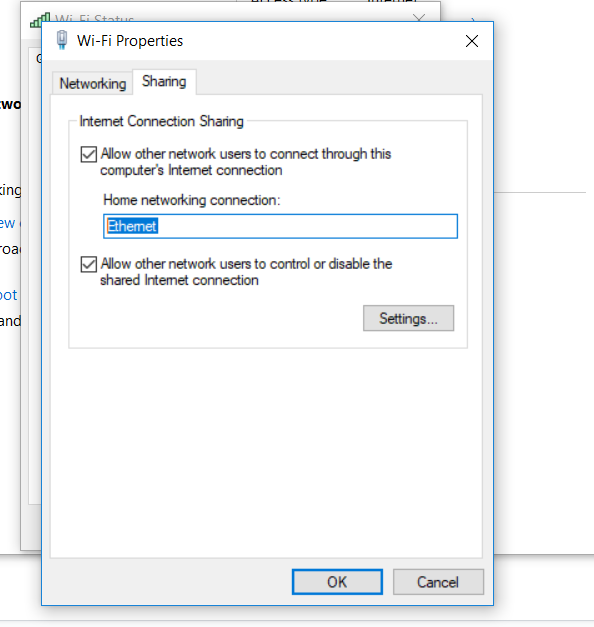
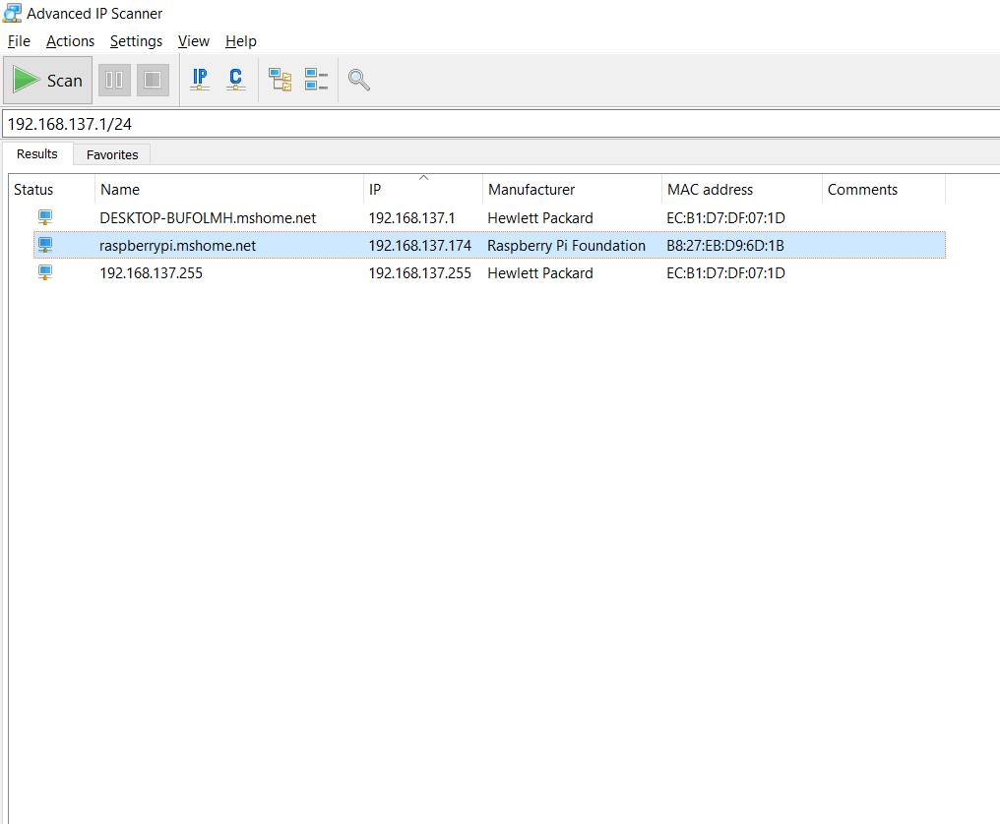
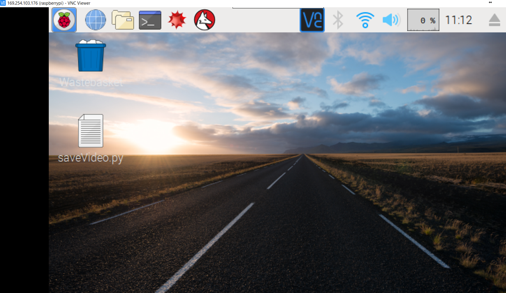
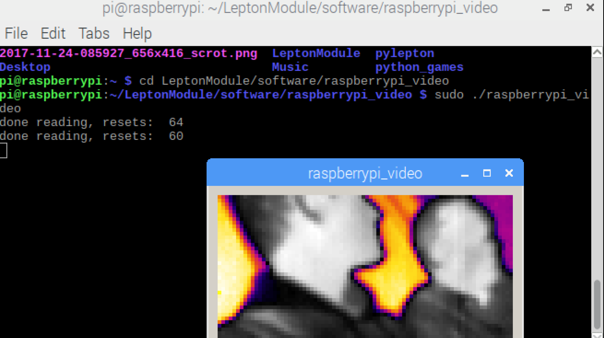

#Hardware used:
- Raspberry Pi V3 model B;
- Flir Lepton Thermal Camera;
- ethernet CAT cable
- Power cables.
- Screen
- Keyboard and Mouse

#Sofware Used:
- Real VNC (a screen sharing software that enables you remotely control the rapsberry pi using a GUI https://www.realvnc.com/en/)
- Advanced Ip scanner ( a free network scanner to help find the ip address of the pi)

#PRE-STEP
For the first time, connect the Pi to a screen preferably using an HDMI cable and Enable VNC, SSH, SPI and I2C services using raspi-config or the graphical preferences interface.
Connect Pi and laptop with ethernet cable to set up the network connection for the first time. 

#STEPS
1. connect the camera wires to the pi in the following order through the respective cable labels;
use the following picture from this link to get a visual of the cable labels

https://www.jameco.com/Jameco/workshop/circuitnotes/raspberry_pi_circuit_note_fig2.jpg

cs → GPIO8 
mosi → GIPO10 
miso → GIPO9 
clk → GPIO11 
gnd → gnd
vin → 3V3 
sda → GPIO2 
scl → GPIO3

2. Download all the required third party software as listed above.
3. Start Real VNC and Advanced IP Scanner
4. using Advanced Ip Scanner, scan for IP adresses starting from your local machine's Ip address ( for windows, use ipconfig from command prompt to find it - https://kb.wisc.edu/page.php?id=27309) up to the highest range; mostly 254.

5 Go to network and sharing centre on your windows computer, click wifi network, choose properties and click the sharing tab.check allow other users to connect through this hardware.

select one ethernet connection from the drop down and click ok.
6. The rapsberry pi should be visible now with name (rapsberrypi.mshome.net) or the manufacturer name which is likely to be (Rapsberry Pi Foundation)

7. open vnc viewer and enter the rapsberry pi IP address as requested by the viewer and connect.
8. Enter user name and password in the next window (username: pi, password: raspberry)
9. Alternatively, using an access point from your computer, connect the pi using a wireless IP address and disconnect the ethernet cable.
10. The raspberry should show a GUI as shown below.

#Install dependencies:
- Make sure the Pi has internet connection and type the following in the pi console: 
  sudo apt-get install qt4-dev-tools
  
- Install git by typing this to the terminal: 
  sudo apt-get install git
  
- Find the LeptonSDKEmb32PUB directory using the following commands and hit enter:
  cd LeptonModule/software/raspberrypi_video
  
- Once there, type 'make' in the terminal. Finally go back to the raspberrypi_video directory (cd ..) and type qmake && make in the terminal.
  
 - Download and install the Lepton Module by typing the following to the console: 
   git clone https://github.com/groupgets/LeptonModule.git. 
  
 - Using the pi terminal, browse to the Lepton Module directory by typing this and hit enter:
    ls (lists the files inside the current directory we are in)
    then type:
    cd LeptonModule/software/raspberrypi_video
    
  - Execute the executable file name raspberrypi_video by typing this and hit enter:
    sudo ./raspberrypi_video
  - hold the camera into position and a thermal video will be displayed.
    
  

